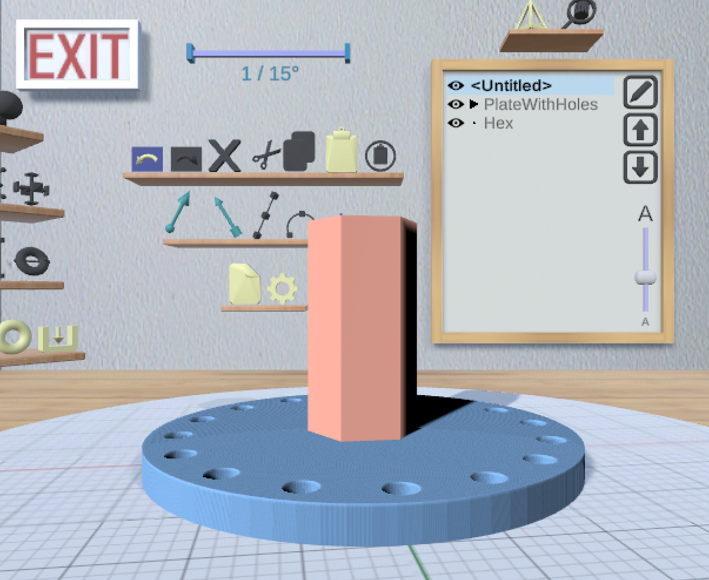

<!--
Note that the cinder theme has a maximum of 3 levels for its table of
contents. Instead of using the first level (h1) for the title, create a title
div.
-->

Welcome to MakerVR

&nbsp;

{: style="height:256px;float:right" }

MakerVR is a VR-enabled application for creating 3D-printable models.
"VR-enabled" means that it can be used in VR, but also works in a standard
mouse+keyboard configuration. In fact, it can also be used in VR without the
headset on. You can use any combination of VR controllers, mouse, and keyboard
in that mode.

Models may be saved as STL files that can then be sent to a 3D printer.

MakerVR is available for Windows and Linux. There is also a Mac version, but it
may or not work in VR due to the [lack of official SteamVR
support](https://store.steampowered.com/news/app/250820/view/2216278054495230717);
I was unable to get SteamVR to display on the HTC Vive from a Macbook, but that
might be due to specific hardware limitations. There is also [some missing
shader support](https://docs.unity3d.com/Manual/Metal.html) which means that it
is not possible to display polygonal edges on models.

# Installing and Running MakerVR

The application is available as Zip files in the [MakerVR distribution GitHub
repository](https://github.com/pss959/MakerVR-dist). Download the Zip file for
your operating system, extract it anywhere, and execute the `MakerVR`
executable file in the resulting directory.

MakerVR is pretty intuitive once you get to know a few things. You could try
using it right away without any guidance, but you'd probably be better off
taking a look at the [User Guide](UserGuide.md) first.

# VR Setup

MakerVR has been tested only with the [HTC Vive](https://www.vive.com/) and
[Oculus Quest 2](https://www.oculus.com/quest-2/). It may work with other
devices as well. (I can't tell because I don't have them.)

If you are running MakerVR on Windows without any VR device connected, it will
attempt to open SteamVR anyway, causing an error window to appear. You can just
ignore it.

## HTC Vive

The Vive needs to be connected to your computer (HDMI and USB). On Linux, you
will probably need to start SteamVR first before running MakerVR with the Vive
attached. I find it easiest to use MakerVR while in a comfortable seated
position, so set up your Vive room accordingly if that's what you want.

## Oculus Quest 2 (Windows Only)

+ Connect the Quest to a USB 3 port.
+ Enable Oculus Link on the Quest.
+ Make sure the Oculus app is open.
+ Run MakerVR. Things should work properly.

# Feedback

Please use the [GitHub
repository](https://github.com/pss959/MakerVR-dist) to report any issues.
