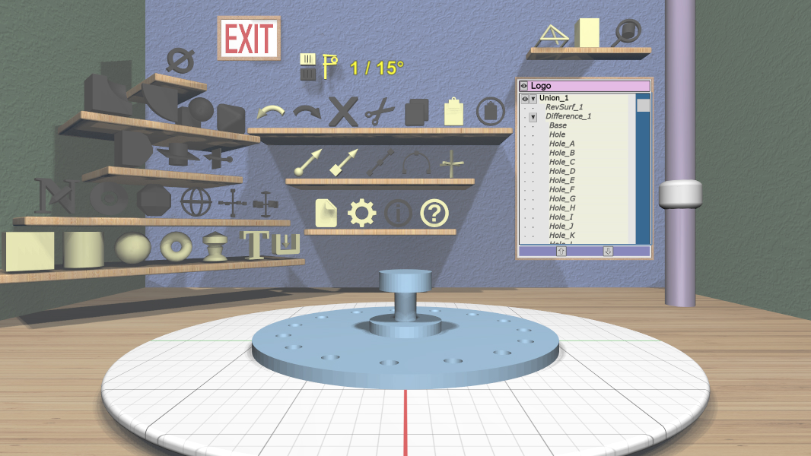

# EasyMaker3D

 

EasyMaker3D is a desktop application for building models for 3D printing. It is
aimed at users who may not have much experience with creating 3D models. It is
designed to be much easier to learn to use than most modeling applications.

Full user documentation, including installation instructions, a quickstart, and
a user guide, can be found on the [EasyMaker3D Github documentation
site](https://pss959.github.io/EasyMaker3D/).

Anyone interested in the source code can find more information in the internal
documentation. This documentation can be created by installing the [`SCons`
software construction tool](https://www.scons.org/) and running `scons -j8
InternalDoc` in a terminal shell in the top-level directory. After doing this,
point your browser at `build/InternalDoc/html/` to view the results.
